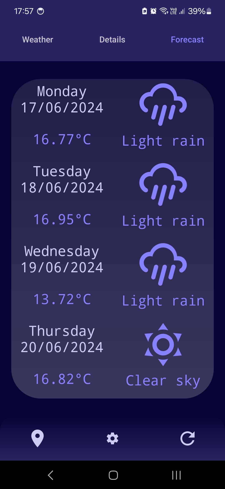

# Weather Check

 

     

App presenting weather and forecast in selected location based on <a href=https://openweathermap.org/api>OpenWeather-API</a>.

## Features

- Select current location.
- Select predefined locations.
- Select location by coordinates or name.
- Save searching history.
- Change units.
- Automatically reload data.

## Release

`
v1.0
`

## Technologies

- Android SDK 34
- JVM 1.8
- Gradle 8.2.2
- Kotlin 1.9.22
- Jackson 2.15.2
- OkHttp3 4.12.0
- Android Material 1.11.0

## Preview

     

